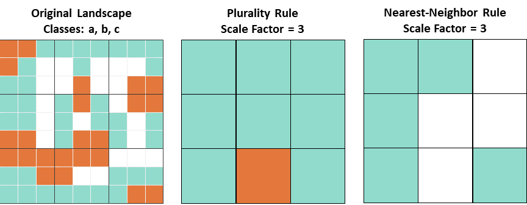

## Processing Environment

### Installation of Required Packages

The required packages for this tutorial that will be installed together with their dependencies:

- landscapeScaling
- terra
- sf
- NLMR (dep.: raster, rgdal)
- landscapetools
- caret

```{r setup, include=FALSE}
library(learnr)
knitr::opts_chunk$set(echo = FALSE)

# set up color scheme 
col12 <- c('#882255','#CC6677','#332288','#DDCC77','#117733','#88CCEE','#44AA99','#999933','#AA4499','#000000','#FFFFFF','#888888')
 
# install missing packages
packages_installed <- rownames(installed.packages())

# required package names from CRAN
packages <- c('remotes','devtools','landscapetools','terra','sf','leaflet','compositions','caret')

# install missing packages not yet installed
installed_packages <- packages %in% rownames(installed.packages())
if (any(installed_packages == FALSE)) {
  install.packages(packages[!installed_packages],repo = 'https://cran.uni-muenster.de/', dependencies = TRUE)
}
# remotes packages
if(!'RandomFieldsUtils' %in% packages_installed){
  remotes::install_github("cran/RandomFieldsUtils")
}
if(!'RandomFields' %in% packages_installed){
  remotes::install_github("cran/RandomFields")
}
if(!'NLMR' %in% packages_installed){
  remotes::install_github("ropensci/NLMR")
}
# install latest updates of landscapeScaling version
devtools::install_github("gannd/landscapeScaling", force=TRUE)

print('All required packages were installed')

# load libraries
library(NLMR)
library(landscapetools)
library(sf)
library(terra)
library(scales)
library(landscapeScaling)
library(caret)
```

#### *The R package {landscapeScaling}*

The package {landscapeScaling} provides the methods and functions to upscale categorical raster data using the Multi-Dimensional Grid-Point scaling method by @Gann_2019. The method generates a new classification scheme on the basis of user desired class label precision of mixed classes and representativeness of the scaled classes across the landscape of interest. 

The scaling procedure creates scaled categorical raster maps with mixed classes, a corresponding continuous raster with compositional information retention calculations for each scaled grid cell, class-specific and landscape-level mean and standard deviation of information retention.

The current version of {landscapeScaling} was installed from [GitHub](https://github.com/) with devtools:

devtools::install_github("gannd/landscapeScaling") (installed during setup).

The functions for MDGP-Scaling can be divided into two types of functions. The low-level functions follow a step-wise procedure of the scaling process. The high-level function 'mdgp_scale_raster' nests several functions to produce a scaled product from the raw categorical raster input. We will explore first the step-wise procedure before using the nested functions.

### Verify Working Directory
```{r, wd-verify, exercise=TRUE, eval=FALSE}
# get the working directory
getwd()

# get the {terra} package temp folder options 
terraOptions()
```


**Check the working directory. This location will change every time you run the chunk -- try it. Therefore, we will have to set our working directory explicitly in every chunk where write data for subsequent exercises, and when we read the data.**

## Spatial Scale and Scaling 

Scale is a **property of the observer of a system** and is defined by **extent** and **grain** at which the system is **sampled** (the sampling rate). **Every model** includes scaling procedures and makes **assumptions**.

When we observe a system at different spatial scales and hierarchical levels different patterns emerge. Temporal analysis of system state changes rely on the tractability of spatial patterns so that they compare across space and time. Spatial scales of data vary over time and comparability is lost. With the ever increasing spatial and temporal resolution of remotely sensed data, the need for good scaling practices is increasing.

### Why Do We Need Spatial Scaling? 

To apply models that are informed by small-scale data at larger scales (larger extent and/or grain size) data samples (point or spatially exhaustive data) are scaled or aggregated. 

Many ecological models rely on information patterns of distribution and dynamics of *primary producers* (i.e plant species, communities, or morphological or functional types of vegetation). Three examples that demonstrate the importance of appropriate scaling of vegetation information for ecological models. 

#### Earth System Models
Earth system models (ESM) rely on remote sensing-derived products at various scales. Scaling methods have been developed to extrapolate primary productivity from the leaf and plant community scales to retrieve ecosystem, regional, and biome estimates of primary productivity @Sellers_1985, @Tucker_Sellers_1986, @Field_1991. 

The relationship between gross primary productivity (GPP) and photosynthetically available radiation (PAR) in the photosynthetically active wavelengths is a function of the amount of photosynthetically active biomass, which can be approximated by leaf area, the incident radiation intercepted by the active biomass, and the photosynthetic efficiency with which the fraction of absorbed PAR (fPAR) is converted into biomass. The two important biophysical variables, leaf area and fPAR, can be retrieved from spectral reflectance measurements of remotely sensed imagery. 

The most commonly used vegetation index to estimate fPAR is the normalized difference vegetation index (NDVI) @Baret_2007, @Ganguly_2008, @Cristiano_2010, @Du_2016. The MOD17 algorithm, for instance, relies on data from the Moderate Resolution Imaging Spectroradiometer (MODIS) @Running_1999, @Running_Zhao_2015 to estimate fPAR from NDVI @Knyazikhin_1999. Errors in retrieval of fPAR will lead to erroneous estimations of GPP. With the proliferation of spaceborne earth pversing satellites at various spatial resolutions, the retrieval of fPAR using vegetation indices has led to the investigation of spectral @Du_2016, @Brede_2020 and spatial scale dependencies @Propastin_2009 and the uncertainties introduced by the retrieval algorithms @Brede_2020, @Pu_2020. Spatial and spectral scale dependencies can be modeled if remotely-sensed data of different sensors can be cross-calibrated and products are comparable across spatial scales. As a result, spatial relationships can be translated to moderate-resolution imagery, acquired at higher temporal resolutions, to account for seasonal variability in productivity rates.

Estimation of biophysical variables using remotely sensed data have been identified and described for a suite of parameters and applications @Lu_2006. Spatial heterogeneity of land cover complicates retrieval and introduces error and uncertainty.

Leaf Area Index (LAI), which estimates green leaf area per unit ground, and Fraction of Photosynthetically Active Radiation (FPAR) are two important biophysical variables in ecosystem gross primary productivity (GPP) models.

Estimation of these variables from Moderate Resolution Imaging Spectroradiometer (MODIS), which has high temporal resolution (daily) but coarse spatial resolution (500 m), relies on land-cover knowledge of each pixel @Steltzer_Welker_2006; @Zhao_2016.

Modeling GPP for wetlands that display high heterogeneity of land cover relative to the coarse resolution of MODIS is difficult @Feagin_2020.

LAI and FPAR are sensitive to land-cover information @Lotsch_2003, and the heterogeneity of vegetation types within a pixel affects LAI estimates in a nonlinear fashion @Garrigues_2006.

LAI errors at a coarse resolution are inversely related to the proportion of the dominant land cover in a pixel and large errors are introduced when the woody component makes up only a small proportion of otherwise non-woody pixels @Tian_2002.

Therefore, maintaining sub-components at smaller fractions is useful for modeling LAI.
 
Lack of knowledge about mixed-pixel composition arises from coarse classification schemes or aggregation of detailed maps with algorithms that do not modify the classification scheme to accommodate mixed pixels (e.g., majority rule) at the scale of modeling the biophysical variable. 

#### Land Cover Distribution and Transition Models
Ecotone expansion rate relative to resolution of sensor or data model (example: mangrove expansion, tree island contraction).

#### Species Distribution Model 
Multi-scale species habitat models. At larger spatial scales mixed habitat presence might be of importance (example: bird habitat -foraging, roosting and nesting; mix of open and closed forest habitat, or mixes of tree species with specialist characteristic for foraging).

### Summary

When modeling ecological processes the scale of analysis needs to be supported by scale and precision of the data that are used in the model. For spatial modeling we often need to scale point or spatially exhaustive data sets to match the scale of analysis.
\t

## Spatial Data Scaling (Aggregation)

### The Problem
Complexity of spatial data scaling is low when the system (e.g., landscape) is homogeneous across space. As heterogeneity of the system increases and processes become more spatially dependent, scaling becomes more challenging.

For **continuous data** we have several statistical methods that allow us to scale or aggregate data to match the scale of analysis using mathematical and statistical methods that include 

- statistics (e.g., mean, standard deviation, median, etc.)
- interpolation (e.g., inverse distance weighted, spline)
- geostatistics (e.g., kriging).

In the case of **categorical data** existing values in the raw data replace the scaled or aggregated unit, regardless of scale factor. The most common methods for categorical data are

- **majority** or **plurality**
- **nearest neighbor**
- **random** selection

These decision rules  oversimplify the patterns that are driven by processes at different spatial scales, homogenizing the landscape with a huge, often not quantified loss of information.

### The Majority or Plurality Rule

The majority rule, in most cases actually a plurality rule, replaces the label of the most common or abundant 'class' or 'category' of a set to the aggregated objects even of no majority is reached. In the case of spatial aggregation of a landscape the class label that is most abundant for the *n* replaced units. 

The scale factors determines how many grid cells get aggregated. If a square kernel with equal weights for each cells is used, the number of cells that are aggregated and replaced with one new cell is $n_{replaced} = sf^2$.  

For example, for a scale factor of three, nine cells are aggregated and the label of the most abundant class of the nine labels is assigned. In the case of nearest-neighbor method the class label of the cell closest to the output grid cell is assigned.
<center>
{ width=75% }
</center>

**Assumptions of the plurality rule are:**

- the original classes (labels) are valid at the aggregated scale regardless of scale factor
- the loss of compositional information in the scaled data is negligible for the model they will be used in

**Describe examples and conditions where these assumptions are problematic.** 
```{r, assumptions-problem, exercise=TRUE}
print('Answer: ')
```

\t

### Compositional Information Retention

Information retention can be defined in many different ways. Here we simply define compositional information retention when aggregating high-resolution data to a lower resolution with the Czekanowski Index:

$$IR_{c} = \sum_{i-1}^{N} min(P_{i}smp, P_{i}scaled)$$ 
$IR_{c}$ is the compositional information retention; $P_{i}smp$ is the proportion of class $i$ of the high-resolution grid within the scaled grid cell, and $P_{i}scaled$ is the proportion of class $i$ retained in the scaled grid cell label. 

Applying the equation to each scaled grid cell in the previous example we obtain loss of information for majority- and nearest-neighbor rule aggregation at the cell-level.  and are demonstrated for a small subset of a 9 x 9 grid cell landscape aggregated with a scale factor of 3 and 9.  

<center>
![*Compositional information retention $IR_{c}$ the cell-level when upscaling categorical data while maintaining the high-resolution classification scheme. For the example landscape, aggregation with the majority rule and nearest-neighbor rule at a scale factor of 3 and 9 retains at most 55.5% of compositional information in any of the cells with minimum retention dropping as low as 11.1% for the nearest-neighbor method when the nearest neighbor only represents 1 of the nine original cells. Mean $IR_{c}$ for the landscape-level is 46.9% for plurality rule and 33% for nearest-neighbor. For a scale factor of 9, landscape-level $IR_{c}$ for plurality rule is 45.7% and for the nearest-neighbor rule only 25.9%. Adapted from @Gann_Richards_2022.*](images/Fig_SF_3_9.png){ width=75% }
</center>

\t
\newpage

### Exercise 1: Quantify Information Retention

Objective: The first exercise will explore the effects of landscape characteristics and scale factor on information loss. 

To explore and demonstrate the complexity of categorical data scaling and the effects of the plurality rule on information loss we will quantify compositional information retention when scaling landscapes with different properties and for different scale factors.

**Procedure:**

- generate a small landscapes with a pre-defined number of categories (richness) and with different levels of spatial heterogeneity
- generate a scaling grid for a specified scale factor to delineate spatial aggregation units 
- assign labels to the scaled grids on the basis of the plurality rule and calculate compositional information retention at the cell level and at the landscape level

To generate the landscapes we will use an R package that generates neutral landscapes with known properties. The package is called Neutral Landscape Models for R (NLMR) https://ropensci.github.io/NLMR/. To categorize the landscapes we will use a function from the 'landscapetools' R package. 

We will then use manually apply the plurality rule that does not modify the classification scheme but only uses original class labels for the spatially aggregated geographic units. 

For plotting purpose a color scheme that is used for all plotting has been set up. The color scheme is a color-blind safe choice (Paul Ton  https://personal.sron.nl/~pault/#sec:qualitative)

```{r, show-color-scheme, eval=TRUE}
print('Color Scheme')
scales::show_col(col12)
```

----

We will first explore landscape characteristics for random landscape patterns. We will vary the number of classes (c) and roughness parameter (r) which controls the level of spatial aggregation. For simplicity, the random landscapes will be rasters with equal numbers of rows and columns.

We will generate a grid that scales the original maps with a scale factor (sf) that is an odd number. This means that each block of *sf* by *sf* cells will be replaced by an aggregated cell. The grid is generated with a function of the {sf} package and plotted on top of the landscape. 

Start with exploring the effects of the roughness parameter (r) on the landscape pattern with three classes. Then increase the number of classes (c), and/or the size of the landscapes (n).

```{r, nlm-1, exercise=TRUE, exercise.lines=42, eval=FALSE, include=FALSE}
## generate a landscape with 'n' by 'n' cells and 'c' classes.
## spatial aggregation is controlled by the roughness parameter 'r'

# landscape characteristics
n <- 10   # number of rows and columns: 1 more than cells per row and column!
c <- 3   # number of classes
r <- 0.04   # roughness

# scaling parameters
sf <- 3   # set the scale factor

# ======= DO NOT MODIFY BEYOND THIS LINE =======

# generate the landscape
nlm <- NLMR::nlm_mpd(ncol = n, nrow = n, roughness = r)

# classify the midpoint-displacement generated grid into x categorical classes
nlm_cat <- landscapetools::util_classify(nlm,n = c)    

# convert the RasterLayer object to a terra SpatRaster
nlm_cat <- terra::rast(nlm_cat)

# assign class names to the three raster values 
levels(nlm_cat) <- data.frame(value=c(1:c),lc=c(LETTERS[1:c])) 
# -----------------------------------------------
# plot the categorized landscape
x11();terra::plot(nlm_cat,col=col12,mar=c(1.5,1.5,1.5,8),
            main=paste0((n-1)^2,' Cell Landscape of ',c,' Classes and Roughness ',r),
            cex.main = 1.2,
            plg=list(title = 'Class Names',
            title.cex = 1, cex = 1),
            pax=list(cex.axis = 1 ))

# generate a grid for scale factor 
g.sf  <- sf::st_make_grid(nlm_cat, square=TRUE, cellsize = floor((n-1)/sf))

# plot the grid
plot(g.sf,add=T,col='transparent',border='black',lwd=2)
```
Change parameters and re-run the code. Increase the number of classes (c), and/or the size of the landscapes (n). Every execution generates a new map that can be compared to the previous ones.

When you understand the effect of all parameters on the landscape pattern and the scaling grid, close all plot windows and complete **Problem 1**.

----

\t
\newline

**Problem 1:** Quantify the effects of landscape heterogeneity (roughness) on class percent differences between original and scaled landscape and on compositional information retention.

- Generate two landscapes with 81 grid cells and 3 classes. One landscape has a roughness of .01, the other .95.
- Scale the landscapes with scale factor 3.
- Calculate percent differences between original and scaled landscape for both landscapes.
- Calculate cell-level and landscape level information retention.

```{r problem-1-landscapes, exercise=TRUE, exercise.lines=40, eval=FALSE, fig.show='hide'}
## generate the landscape with 81 grid cells and 3 classes with r = 0.01 or 0.95

# landscape characteristic
n <- 
c <- 
r <- 

# scaling parameters
sf <- 3

# ========== DO NOT MODIFY BEYOND THIS LINE ==========

# generate the landscape
nlm <- NLMR::nlm_mpd(ncol = n, nrow = n, roughness = r)

# classify midpoint-displacement generated grid into c categorical classes
nlm_cat <- landscapetools::util_classify(nlm,n = c)    

# convert the RasterLayer object to a terra SpatRaster
nlm_cat <- terra::rast(nlm_cat)

# assign class names to the three raster values 
levels(nlm_cat) <- data.frame(value=c(1:c),lc=c(LETTERS[1:c]))

# generate a grid for scale factor 
g.sf  <- sf::st_make_grid(nlm_cat, square=TRUE, cellsize = floor((n-1)/sf))

# calcualte class proportions
class_dist <- terra::freq(nlm_cat)
class_dist$prop <- round(prop.table(class_dist[,3]),3)
print(class_dist)
# -----------------------------------------------
# plot the categorized landscape
x11();terra::plot(nlm_cat,col=col12,mar=c(1.5,1.5,1.5,8),
                  main=paste0((n-1)^2,' Cell Landscape of ',c,' Classes and Roughness ',r),
                  cex.main = 1.2,
                  plg=list(title = 'Class Names',title.cex = 1, cex = 1),pax=list(cex.axis = 1 ))
terra::plot(g.sf,add=T,col='transparent',border='black',lwd=2)

print('ADD THE PROPORTION VALUES IN THE CORRESPONDING VECTOR IN THE NEXT CHUNK BEOFRE RUNNING THE NEXT ITERATION!')
```

After each run, transfer the proportional cover of each class to the "nlm_r.[xx]_cls.prp". 

Determine the scaled class label for each of the nine scaled grid cells using the plurality rule. Add the classes to the vectors "nlm_r.[xx]_scl3.cls" for the corresponding landscapes.

Add syntax to calculate class percentages for each scaled landscape and percent class differences for the scaled landscape in relation to the original class distributions.

```{r problem-1-scale, exercise=TRUE, exercise.lines=20, eval=FALSE, warning=FALSE}
# add the class proportions of the original maps (printed in the console output)
nlm_r.01_cls.prp <- data.frame(class=c('A','B','C'),prp=c(x,x,x))
nlm_r.95_cls.prp <- data.frame(class=c('A','B','C'),prp=c(x,x,x))

# add the nine class labels for each of the two landscapes to each of the class vectors and calculate the percent class cover for the original and scaled grid. 
nlm_r.01_scl3.cls <- c('X','X','X','X','X','X','X','X','X')
nlm_r.95_scl3.cls <- c('X','X','X','X','X','X','X','X','X')

# generate a data frame with percentage cover of each scaled landscape
nlm_r.01_scl3.prp <- as.data.frame(round(prop.table(table(nlm_r.01_scl3)),3))
names(nlm_r.01_scl3.prp) <- c('class_s_3','prp')

nlm_r.95_scl3.prp <- as.data.frame(round(prop.table(table(nlm_r.95_scl3)),3))
names(nlm_r.95_scl3.prp) <- c('class_s_3','prp')

# add code to calculate percent cover differences between scaled and original maps for both landscapes

```

Calculate the cell-specific information retention for both landscapes using the Czekanowski Index and add the numbers for each of the nine grid cells of each landscape to the vectors 'nlm1_ir' and 'nlm1_ir' in the next R chunk. Once both vectors are complete run the chunk to calculate mean IR for each landscape. $$IR_{c} = \sum_{i-1}^{N} min(P_{i}smp, P_{i}scaled)$$ 
$IR_{c}$ is the compositional information retention; $P_{i}smp$ is the proportion of class $i$ of the high-resolution grid within the scaled grid cell, and $P_{i}scaled$ is the proportion of class $i$ retained in the scaled grid cell label.

```{r, nlm-ir, eval=FALSE, exercise=TRUE}
# calculate IRc for each of the 9 scaled grid cells for both landscapes and add the values to the respective vectors, replacing x with the IRc values.
nlmr_r.01_scl3.ir <- c(x,x,x,x,x,x,x,x,x)
nlmr_r.95_scl3.ir <- c(x,x,x,x,x,x,x,x,x)
# -----------------------------------------------
# calculate the mean information retention for both landscapes and print the results
print(nlmr_r.01_scl3.ir_mn <- mean(nlmr_r.01_scl3.ir)) 
print(nlmr_r.95_scl3.ir_mn <- mean(nlmr_r.95_scl3.ir))
```

**Questions Ex. 1**

**What effect did heterogeneity of the landscape have on landscape level class percentage differences and compositional IR when scaling at a scale factor of 3?**

```{r, questions-1-1-response, eval=FALSE, exercise=TRUE}
print('Answer: ')
```
----

\t

## Introduction to MDGP-Scaling
### The Scaling Method
The MDGP-Scaling Algorithm has been developed to allow for more precise data aggregation of categorical data.

* It does not assume that the original classification scheme is valid at the aggregated scale
* It allows the user to define the precision of mixed class labels
* It allows for controlling representativeness of classes across the landscape
* It provides quantitative assessment of compositional information retention (loss) at the cell level and at the landscape level.

### Phytosociology Concept of Classification

Classification of plant communities on the basis of quantitative data and analytical methods is common in vegetation ecology and phytosociology. Quantitative methods for vegetation classification go back to Braun Blanquet (citation) More recent methods and ... are covered in O. Wildi (), DeCaseres (), Tichy () .... 

Criteria of a good classification system:

* representative (three aspects)
* reproducible

What do each of these terms mean?
```{r, questions-1-2-response, eval=FALSE, exercise=TRUE}
print('Answer: ')
```

\t
\newpage

### MDGP-Scaling Algorithm

The MDGP-Scaling algorithm aggregates categorical data while simultaneously generating a non-hierarchical, representative classification system for the aggregated spatial scale similar to the concepts of Phytosociology. 

The scaled data consistently preserves information at a significantly higher rate than other aggregation algorithms that do not account for classification scheme dependence.

#### The Parameters

The three parameters that determine the classes of the scaled classification scheme are: 

**Precision**

* $parts$ relates to the scaled class-label precision of mixed classes. It also controls for local and landscape level information loss

**Representativeness**

* $rpr-threshold$ determines the minimum percent presence of a scaled class across the landscape (study area). Classes that are below the threshold are merged with classes that maximize information retention

* $monotypic-threshold$ determines the threshold for class abundance to be considered a monotypic class and to be retained in the final classification scheme even when present at less than the representativeness threshold across the landscape

----

The larger the parameter **$parts$**, the more classes will be generated, increasing the precision of class-label components in the scaled class labels. 
The number of potential classes is determined by the richness of the original raster, and the precision parameter $parts$ (setting $parts$ to 1 (precision = 100%) is equal to the most commonly used alternative method of plurality rule).

As precision increases, the number of potential **multi-dimensional grid points** increases (black dots). As richness of the original landscape increases the dimensionality of the multi-dimensional grid points increases (blue box: richness = 4).

<center>
{ width=75% }
</center>

----

Three Class Example: Scaling the small three class example landscape with a scale factor of 9 (all 81 grid cells are replaced by 1 scaled grid cell). 

For each precision level, the scaled cell assigned to the grid point that maximizes $IR_{c}$. Comparison across all solutions indicates the maximum information retained for the given precision level. 
<center>
![*Multi-dimensional grid points generated for label precisions ranging from 100% (parts = 1) to 25% (parts = 4) (top to bottom). Richness of the original 81 cell landscape is three (classes a,b and c). The scaled class label list for each precision level (LabelList) is the enumerated list of all grid points. The solution that maximizes categorical information retention $IR_{c}$ for each grid-point solution is emphasized in bold. The last column summarizes the grid-point information the grid cell is assigned. Maximum $IR_{c}$ increases with precision. Adapted from @Gann_Richards_2022.*](images/Fig_SF_5_ir.png){ width=100% }
</center>

----

#### Scaling Entire Landscapes

Scaling entire landscapes using MDGP-Scaling generates frequency distributions of mixed classes. Number of classes and definitions depend on:

* landscape properties (richness, diversity, and spatial aggregation)
* scaling parameters (scale factor, label precision, and representativeness)

----

Example: A neutral landscape with 3 classes A,B and C that have a geometric class distribution and a spatial aggregation of 0 (generated with the mid-point displacement algorithm @NLMR). Applying a **scale factor 5** and varying precision levels from **100%**, **33.3%**, and **20%** results in the following class distributions:   
<center>
![*Landscape scaled with scale factor 5 and class label precisions of 100% (parts=1), 33,3% (parts=3) and 20% (parts=5). Circle size displays absolute scale of class proportions (Prop_AS) across all plots; colour rendered as relative scale of class proportions (Prop_RS) within each plot. Small black dots in the terneray plots indicate that the potential grid point was not realized at the aggregated scale. Class labels are composed of class name and nominal percent representativeness. Adopted from @Gann_2019.*](images/Fig-LS-SF5.png){ width=65% }
</center>


Scaling the same landscape with **scale factor 15** and the same precision levels of **100%**, **33.3%**, and **20%** leads to very different class distributions.

<center>
![*Landscape scaled with scale factor 15 and class label precisions of 100% (parts=1), 33,3% (parts=3) and 20% (parts=5). Circle size displays absolute scale of class proportions (Prop_AS) across all plots; colour rendered as relative scale of class proportions (Prop_RS) within each plot. Small black dots in the terneray plots indicate that the potential grid point was not realized at the aggregated scale. Class labels are composed of class name and nominal percent representativeness. Adopted from @Gann_2019.*](images/Fig-LS-SF15.png){ width=65% }
</center>

----

### Exercise 2: MDGP-Scaling - Plurality Rule

Objective: Compare the effects of scale factor on information retention.

We will first generate the landscape that will then be scaled with scale factors 3 and 5. The scling result will then be converted to rasters of scaled classes and their associated cell-level $IR_{c}$.

----

(1) Generate a 30 x 30 cell categorical raster with 3 land cover classes that have an intermediate spatial aggregation pattern.

```{r, nlm-map, exercise=TRUE, exercise.lines=36, eval=FALSE, fig.show='hide', warning=FALSE}
# set your working directory
setwd('')

# landscape characteristics
n <- 31   # number of rows and columns
r <- 0.56   # roughness
c <- 3   # number of classes

# ========== DO NOT MODIFY BEYOND THIS LINE ==========

# generate the landscape
nlm <- NLMR::nlm_mpd(ncol = n, nrow = n, roughness = r)

# classify the midpoint-displacement generated grid into x categorical classes
nlm_cat <- landscapetools::util_classify(nlm,n = c)    

# convert the RasterLayer object to a terra SpatRaster
nlm_cat <- terra::rast(nlm_cat)

# assign class names to the three raster values 
levels(nlm_cat) <- data.frame(value=c(1:c),lc=c(LETTERS[1:c])) 
# -----------------------------------------------
# plot the categorized landscape
x11();terra::plot(nlm_cat,col=col12,mar=c(1.5,1.5,1.5,8),
            main=paste0((n-1)^2,' Cell Landscape of ',c,' Classes and Roughness ',r),
            cex.main = 1.2,
            plg=list(title = 'Class Names',
            title.cex = 1, cex = 1),
            pax=list(cex.axis = 1 ))

# write the landscape to file so it can be used in the next exercise (not in memory!)
terra::writeRaster(nlm_cat,paste0('./nlm_',n-1,'.tif'),overwrite=TRUE)
```

The landscape was written to the wroking directory folder as a ".tif" file. It will be loaded in all subsequent chunks.

----

(2) Scale the landscape with scale factors 3 and 5.

- Calculate the relative abundance of original classes for a specific scale factor using the ‘relative_abundance_scaled_grid’ function. First, the lower left corner of each of the scaled grid cells is generated, followed by the tabulation of relative abundance of the high-resolution classes within each scaled grid cell

  - The x and y coordinates of the lower left corner for each scaled grid cell and the relative abundance for each cell are returned as data frame

  - Potential MDGPs are generated using the class label precision parameter $parts$ and the landscape richness (number of classes) 

- Using the 'mdgp_scale' function, each cell is classified (assigned) to the MDGP that maximizes $IR_{c}$ . 

  - The 'mdgp_scale' function requires arguments $parts$ for the class label precision, the representativeness threshold $prp-threshold$, and the monotypic class threshold $monotypic-threshold$. We will keep not restrict the representativeness or use monotypic class threshold for now.

For each scaled grid cell, the function returns the original class abundances, the lower left corner coordinate (x_y), the scaled class label and the corresponding $IR_{c}$. The function returns a data frame.

```{r, nlm-classify, exercise=TRUE, eval=FALSE, fig.show='hide'}
# set working directory
setwd('')

# read the landscape
map <- terra::rast('./nlm_[X].tif')   # replace X wit the resolution of the map to be used
classField <- 'lc'

# set the precision parameter parts
prts <- 1 

# set the scale factor
sf <- 3

# out file name prefix
prfx <- 'nlm_30' 

# ======= DO NOT MODIFY BEYOND THIS LINE =======

# calculate the relative abundance
rel_abund <- landscapeScaling::relative_abundance_scaled_grid(map,class_field=classField,scale_factor=sf)

# write relative abundance to file
write.csv(rel_abund,file=paste0('./data/',prfx,'_sf',sf,'_rel_abund.csv'))

# classify relative abundance samples to multi-dimensional grid points with no restrictions on the representativeness threshold or monotypic class threshold
mdgp_result <- landscapeScaling::mdgp_scale(rel_abund,parts=prts,rpr_threshold=0,monotypic_threshold=100)

# write the scaled data frame to .rds file
saveRDS(mdgp_result,file=paste0('./',prfx,'_sf',sf,'_prts',prts,'.rds'))
```

----

(3) Convert the classified points and the corresponding location-specific information retention to raster. 

A list with three objects is returned:

- the rasterized classified cells
- the rasterized compositional information retention
- a list with two objects
  + the class-specific mean and standard deviation of information retention as a data frame
  + the landscape scale aggregated mean and standard deviation as a list

We will first load the saved results from the previous chunk output. Replace the X.rds with the name of the mdgp_results you want to convert to raster.

The function to convert scaling results to raster is 'scaling_result_to_raster'. function.

```{r, nlm3-mdgp-to-raster, exercise=TRUE, eval=FALSE, fig.show='hide'}
# set working directory
setwd('')

# read the scaling results object
mdgp_result <- readRDS('./X.rds') # replace X.rds with the name of the scaling results file

# set the precision parameter parts
prts <- 1

# set the scale factor
sf <- 3

# ======= DO NOT MODIFY BEYOND THIS LINE =======

# convert classified points and location-specific information retention to raster
mdgp_raster <- landscapeScaling::scaling_result_to_raster(mdgp_result,class_name_field='class_name',scale_factor=sf)

# plot the scaled map
x11();terra::plot(mdgp_raster[[1]],col=col12,mar=c(1.5,1.5,1.5,8),
            main=paste0('Scaled Classes: Parts=',prts,'; SF=',sf),cex.main = 1.2,
            plg=list(title = "Class Names",title.cex = 1, cex = 1),
            pax=list(cex.axis = 1 ))

# plot information retention of the scaled map
x11();terra::plot(mdgp_raster[[2]],col=gray.colors(20,start=0.1,end=1),mar=c(1.5,1.5,1.7,8),
            main=paste0('Information Retention: Parts=',prts,'; SF=',sf),cex.main = 1.2,
            plg=list( title = "IR %",title.cex = 1, cex = 1),
            pax=list(cex.axis = 1 ))

# print the class-specific and landscape scale summary statistics 
print(mdgp_raster[[3]])
```

----

**Questions Ex. 2**

**What is the difference between location-specific, landscape-level and class-level information retention?**
```{r, questions-2-response, exercise=TRUE, eval=FALSE}
print('Answer: ')
```

\t
\newpage

### Exercise 3: MDGP-Scaling - Class-Label Precision and Representativness Threshold

We will now explore the effects of MDGP-Scaling parameters 'parts' and 'rpr_threshold' and compare information retention and class number.

Modify one parameter at a time, with settings for 'parts' ranging between 1 and 9 and landscape representativeness between 0% and 20%.  

Explore different combinations of settings.

```{r, nlm3-mdgp-explore, exercise=TRUE, eval=FALSE, fig.show='hide'}
# set working directory
setwd('')

# read relative abundance table from file
rel_abund <- read.csv('./X.csv')

# set parts between 2 and 5 corresponding to 50% up to 20% class label proportion (precision)
prts <- 2

# set representativeness and monotypic class thresholds 
rpr <- 0
mono <- 100

# ======= DO NOT MODIFY BEYOND THIS LINE =======

mdgp_result <- mdgp_scale(rel_abund,parts=prts,rpr_threshold=rpr,monotypic_threshold=mono)
print(mdgp_result)
# -----------------------------------------------
# convert classified points and location-specific information retention to raster
mdgp_raster <- landscapeScaling::scaling_result_to_raster(mdgp_result,class_name_field='class_name',scale_factor=sf)
# -----------------------------------------------
# plot the scaled map
x11();terra::plot(mdgp_raster[[1]],col=col12,mar=c(1.5,1.5,1.5,8),
            main=paste0('Scaled Classes for ',prt,' parts'),cex.main = 1.2,
            plg=list( title = "Class Name",title.cex = 1, cex = 1),
            pax=list(cex.axis = 1 ))

# plot information retention of the scaled map
x11();terra::plot(mdgp_raster[[2]],col=gray.colors(20,start=0.1,end=1),mar=c(1.5,1.5,1.7,8),
            main=paste0('Information Retention for ',prt,' parts'),cex.main = 1.2,
            plg=list( title = "IR %",title.cex = 1, cex = 1),
            pax=list(cex.axis = 1 ))
# -----------------------------------------------
# print the class-specific and landscape scale summary statistics 
print(mdgp_raster[[3]])
```

----

**Problem 3:** Complete the same exercise with a scale factor of 5.

**Questions Ex. 3**

```{r, questions-3-response, exercise=TRUE}
print('Answer: ')
```

----

### Summary of MDGP-Scaling Concept

Summary and Conclusions

----

## Scaling of Real Landscapes

When scaling real landscapes and the extent of the area is very large, it is very time-consuming to use brute force to determine the scaled classification scheme. The answer to three questions will decide the approach.

- define the purpose
  - change detection from lower resolution data
  - extraction of biophysical variables from coarser remotely sensed data
- determine grid alignment needs
  - specific sensor grid
  - explore random origin uncertainties
- decide if the whole landscape (map) or samples will be used to determine classification scheme
  - might be a good approach if the landscape is too large
  - any spatial sampling design could be implemented
  
----

### Exercise 4 - Scaling of an Everglades Wetland Landscape

Study Area: A small subset of a wetland within Water Conservation Area 3A in the greater Everglades ecosystem complex. The study area is a healthy landscape with the typical ridge and slough pattern of alternating  ... .

The study area was mapped from 2010 and 2013 WorldView 2 (WV2) bi-seasonal data acquired during wet conditions in Novemeber 2010 and dry conditions in May 2013. 

The plant communities that were mapped from WV 2 are: 
```{r, load-pc-lut, eval=FALSE, include=TRUE}
print(read.csv(paste0(R.home(),'/library/mdgpTutorial/tutorials/MDGP_Scaling/data_raw/plant_communities_13_classes_LUT.csv')))
```
The original classes were reclassified to simplify the classification scheme for this exercise. The reclassified map has five classes that are reclassified according to the reclass table.

```{r, load-rcl-lut, eval=FALSE, include=TRUE}
print('The classes are reclassfied to: ')
print(read.csv(paste0(R.home(),'/library/mdgpTutorial/tutorials/MDGP_Scaling/data_raw/plant_communities_RCL.csv')))

print('The reclassified map LUT: ')
print(read.csv(paste0(R.home(),'/library/mdgpTutorial/tutorials/MDGP_Scaling/data_raw/plant_communities_5_classes_LUT.csv')))
```

----

```{r, map-reclass, eval=FALSE, exercise=TRUE, include=TRUE}
## Reclassify the original Plant Community Map to Morphological Classes 

# set working directory
setwd(wd)

# load map 
veg_map <- terra::rast(paste0(R.home(),'/library/mdgpTutorial/tutorials/MDGP_Scaling/data_raw/plant_communities_wv2.tif'))
lut13 <- read.csv(paste0(R.home(),'/library/mdgpTutorial/tutorials/MDGP_Scaling/data_raw/plant_communities_13_classes_LUT.csv'))
levels(veg_map) <- lut13
print(veg_map)

# load the reclassification table
rcl <- read.csv(paste0(R.home(),'/library/mdgpTutorial/tutorials/MDGP_Scaling/data_raw/plant_communities_RCL.csv'))

# reclassify the map
veg_map_rcl <- terra::classify(veg_map,rcl[,c(1,3)])
lut5 <- read.csv(paste0(R.home(),'/library/mdgpTutorial/tutorials/MDGP_Scaling/data_raw/plant_communities_5_classes_LUT.csv'))
levels(veg_map_rcl) <- lut5

terra::writeRaster(veg_map_rcl,paste0(R.home(),'/library/mdgpTutorial/tutorials/MDGP_Scaling/data_raw/plant_communities_5_classes.tif'),overwrite=TRUE)
x11();terra::plot(veg_map_rcl)
```
----

**Questions Ex. 4**

**What is the spatial resolution of the original map?**

**What is the scale factor if we want to scale this map to Landsat 30 m resolution?**

**What is the scale factor if we want to scale this map to Sentinel 20 m resolution?**

**What is the scale factor if we want to scale this map to MODIS 250 m resolution?**

```{r, questions-4-1-response, exercise=TRUE}
print('Answers: ')
```
----

Generate the relative abundance of classes with scale factor 15. The relative abundance data frame will be saved to .csv to be used in the following chunks.

```{r, sf-rel-abund, exercise=TRUE, exercise.lines=25, eval=FALSE, fig.show='hide'}
# set working directory
setwd('')

# load map 
veg_map <- terra::rast(paste0(R.home(),'/library/mdgpTutorial/tutorials/MDGP_Scaling/data_raw/plant_communities_5_classes.tif'))
classField <- 'class'

# subset the map to an area that captures the overall pattern of the landscape
veg_map <- terra::crop(veg_map,terra::ext(518000,518300,2858500,2858800))

# set the scale factor
sf <- 15

# ======= DO NOT MODIFY BEYOND THIS LINE =======

# calculate the relative abundance
system.time(rel_abund <- landscapeScaling::relative_abundance_scaled_grid(veg_map,class_field=classField,scale_factor=sf))

# write relative abundance to .csv file
write.csv(rel_abund,file=paste0('./pc5_sf',sf,'_rel_abund.csv'),row.names = FALSE)
```

----

**Questions**

**What are the expected dimensions (number of rows and columns) of the output grid?**
** ... ?**

```{r, questions-4-2-response, exercise=TRUE}
print('Answers: ')
```
----

Explore the effects of class-label precision (parts) and representativeness on compositional information retention.
parts: 1 - 5
representativeness: 0, 1, 5, 10, 20


```{r, map-scale, exercise=TRUE, exercise.lines=50, eval=FALSE, fig.show='hide'}
## Explore the effects of class-label precision (parts) and representativeness on compositional information retention.
## parts: 1 - 5
## representativeness: 0, 1, 5, 10, 20
# --------
# set working directory
setwd('')

# load relative abundance
rel_abund <- read.csv('./pc5_sf15_rel_abund.csv')
print(head(rel_abund))

# set output prefix
prfx <- 'pc5_sf15_'

# set parts between 2 and 5 corresponding to 50% up to 20% class label proportion (precision)
prts <- 2

# set representativeness and monotypic class thresholds 
rpr <- 0
mono <- 100

# ======= DO NOT MODIFY BEYOND THIS LINE =======

# classify relative abundance samples to multi-dimensional grid points with no restrictions on the representativeness threshold or monotypic class threshold
mdgp_result <- landscapeScaling::mdgp_scale(x=rel_abund,parts=prts,rpr_threshold=rpr,monotypic_threshold=mono)
print(mdgp_result)

# write the scaled data frame to .rds file
saveRDS(mdgp_result,file=paste0('./',prfx,'prts',prts,'_rpr',rpr,'_mono',mono,'.rds'))
# -----------------------------------------------
# convert classified points and location-specific information retention to raster
mdgp_raster <- landscapeScaling::scaling_result_to_raster(scaling_result=mdgp_result,class_name_field='class_name',scale_factor=sf)
# -----------------------------------------------
# plot the scaled map
x11();terra::plot(mdgp_raster[[1]],col=col12,mar=c(1.5,1.5,1.5,8),
            main=paste0('Scaled Classes: parts=',prts,'; rpr=',rpr,'; mono=',mono),cex.main = 1.2,
            plg=list( title = "Class Name",title.cex = 1, cex = 1),
            pax=list(cex.axis = 1 ))

# plot information retention of the scaled map
x11();terra::plot(mdgp_raster[[2]],col=gray.colors(20,start=0.1,end=1),mar=c(1.5,1.5,1.7,8),
            main=paste0('Information Retention for ',prts,' parts'),cex.main = 1.2,
            plg=list( title = "IR %",title.cex = 1, cex = 1),
            pax=list(cex.axis = 1 ))
# -----------------------------------------------
# print the class-specific and landscape scale summary statistics 
print(mdgp_raster[[3]])

# write scaled results to .tif
terra::writeRaster(mdgp_raster[[1]],file=paste0('./',prfx,'prts',prts,'_rpr',rpr,'_mono',mono,'_class.tif'))
```

---

**Questions**

**... ?**
**... ?**
```{r, questions-4-3-response, exercise=TRUE}
print('Answers: ')
```

## Detection of Scaled Classes from Multi-spectral Data

Objective: Explore the detectability of the differently scaled classes in the previous exercise from multi-spectral Landsat data.  The fine-resolution map was scaled to 30 m resolution using different label precision and representativeness combinations.

Select the map you want to determine the class detectability first. 

Important factors to consider when scaling: 

- The actual grid origin of the multi-spectral data needs to be used for relative abundance calculations. 

----

### Exercise 5: Detection of Scaled Classes from Landsat Data

In the last exercise we will test the detection accuracy of the scaled classes from Landsat multi-spectral data. The data set we are using is a Landsat 5 scene from 2011-11-10. The image was subset to the study area that was mapped from the 2010 and 2013 WorldView bi-seasonal data.

In our previous scaling exercise (Exercise 3) the Landsat grid was used in the scaling procedure and the Landsat pixels are aligned with the scaling results. 

Processing and Analysis Steps:
(1) extract signatures for all classes for centroids of the scaled map
(2) use random forest classifier to evaluate the detectability of the classes from the spectral signatures
(3) predict the map from spectral data

Accuracy Assessment
(1) model-based cross-validation accuracy
(2) partial-credit weighted accuracy

----

Explore the spectral data: We will load the subset Landsat scene and plot 2 band combinations

```{r, ls-inspect, exercise=TRUE, eval=FALSE, fig.show='hide'}
# set working directory
setwd('')

# load spectral Landsat data
ls <- terra::rast(paste0(R.home(),'/library/mdgpTutorial/tutorials/MDGP_Scaling/data_raw/L5TM_20111110_atmcor_sub.tif'))

# plot RGB of band combination 5,4,3.
x11();terra::plotRGB(ls, 5, 4, 3, stretch="hist")
```

---

Evaluate the detectability of the scaled classes from .

The next block of code will:
- load the scaled map with mixed class labels
- convert the map to points
- extract spectral signatures for each 30 m grid cell from the Landsat stack
- evaluate the class separability using cross-validated random forest models
- calculate the partial-credit weighted accuracy

The parameters that need to be set for the random forest calssifier training 

```{r, sig-eval, exercise=TRUE, eval=FALSE}
# set working directory
setwd('')

# load sourced function
source(paste0(R.home(),'/library/mdgpTutorial/tutorials/MDGP_Scaling/functions/partial_credit_weighted_accuracy.R')

# landsat image
ls_nme <- 'L5TM_20111110_atmcor_sub.tif'

# scaled map name to evaluate
map_nme <- 'pc5_sf15_prts1_rpr0_mono100_class.tif'

## set random forest parameters
# number of trees
nTree <- 200

# training control
trCtrl <- caret::trainControl(
		method = 'cv',
		number = 5,
		classProbs= TRUE,
		allowParallel = TRUE,
		verbose = TRUE,
		savePredictions = TRUE)

# variable retention sizes
gridTune <- expand.grid(mtry = c(2:4))
nrow(gridTune)

# ========== DO NOT MODIFY BEYOND THIS LINE ==========

# load spectral Landsat data
spc.rst <- terra::rast(paste0('R.home(),/library/mdgpTutorial/tutorials/MDGP_Scaling/data_raw/,ls_nme'))

# load scaled map and convert to vector
map_class <- terra::rast(paste0('./',map_nme))
map.pnt <- terra::as.points(map_class, na.rm=TRUE)

# extract signature and join to class info
trnDat <- as.data.frame(terra::extract(spc.rst, map.pnt, bind=TRUE))
head(trnDat)
# -----------------------------------------------

# CROSS-VALIDATED RANDOM FOREST MODEL

mdlFit <- caret::train(trnDat[,2:7],as.character(trnDat$class_name),trControl = trCtrl, metric='Accuracy', method='rf', tuneGrid=gridTune, ntree=nTree, importance=TRUE)
print(mdlFit)
# -----------------------------------------------

# MODEL-BASED CROSS-VALIDATED ACCURACY ESTIMATES

# evaluate confusion matrix and write to file
mtxCnf.cv <- confusionMatrix(prdCV$pred,prdCV$obs)

# write class-specific evaluation and confusion matrix to file
write.table(mtxCnf.cv$byClass,paste0('./',prfx,'_mtxCnf_stats.csv'))
write.table(mtxCnf.cv$table,paste0('./',prfx,'_mtxCnf.csv'))
# -----------------------------------------------

# MODEL-BASED CROSS-VALIDATED PARTIAL-CREDIT WEIGHTED ACCURACY ESTIMATES

# uses the class-label agreement as weights for partial credit
# sourced functions: partial_credit_weighted_accuracy.R in /functions folder

# read cross-validated confusion matrix
mtxCnf <- mtxCnf.cv$table

# vectorize the weighting function
prtlCrdtWghts_V <- Vectorize(prtlCrdtWghts,vectorize.args = c('r_nme','c_nme'))

# generate weight matrix
mtxCnf_wght <- outer(rownames(mtxCnf),colnames(mtxCnf), prtlCrdtWghts_V)

# weight adjusted accuracy
wghtAcc <- wghtAdjAcc(cm=mtxCnf,wm=mtxCnf_wght)

# calculate weighted accuracies and confidence intervals
oaCV_wght <-  round(wghtAcc$sum.naive, 4)
ciAlpha <- ci(wghtAcc$sum.var, wghtAcc$sum.n,.05)
oaCV_wght_CIL <- round((wghtAcc$sum.naive-ciAlpha),4)
oaCV_wght_CIU <- round((wghtAcc$sum.naive+ciAlpha),4)
```

```{r, spec-eval, exercise=TRUE, eval=FALSE, fig.show='hide'}
# set working directory
setwd('')

# load scaled map and associated information retention layer
map_scl <- terra::rast('./[SCALED_MAP_NAME].tif')

# load information retention raster and calculate landscape level mean
map_infRtn <- terra::rast('./[SCALED_MAP_IRC_NAME].tif')
print(infRtnRL <- cellStats(map_infRtn, 'mean'))
```

Repeat the exercise for the other scaling results (precision and representativness threshold combinations) 

---

**Questions**

**How did increased precision of class-labels affect the detection accuracy from Landsat data?**
**How did increased representativeness affect the detection accuracy from Landsat data?**
**What are the trade-offs?**
```{r, questions-5-2-response, exercise=TRUE}
print('Answers: ')
```

----

## Acknowledgements

This tutorial and the package **landscapeScaling** rely heavily on functions from R packages **terra** [@terra], **sf** [@sf_1, @sf_2] **compositions** [@compositions], **NLMR** and **landscapetools** [@NLMR], **partitions** [@partitions].

## References {-}

<div id="refs"></div>

#### EOF